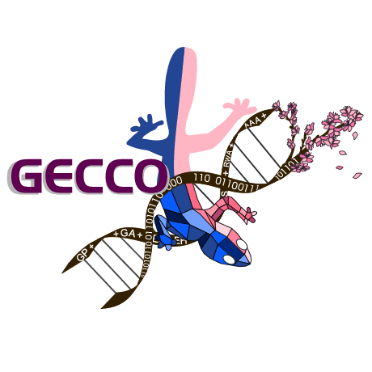
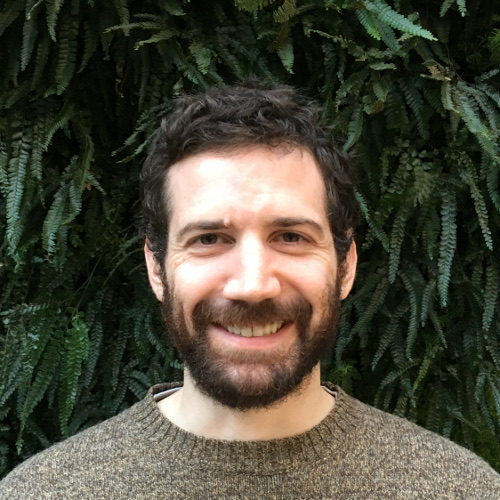
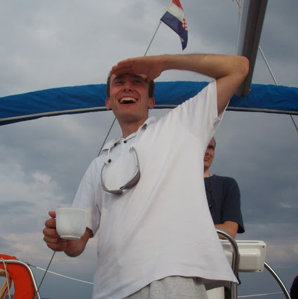
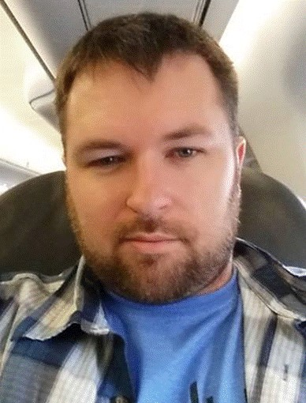

Date: **July 16, 2018**

Location: Kyoto, Japan @ [GECCO 2018](http://gecco-2018.sigevo.org/)

### Workshop Description

Benchmarks are one of the primary tools that machine learning researchers use to demonstrate the strengths and weaknesses of an algorithm, and to compare new algorithms to existing ones on a common ground. However, numerous researchers---including prominent researchers in the evolutionary computation field [[1](https://cs.gmu.edu/~sean/papers/gecco12benchmarks3.pdf), [2](http://dl.acm.org/citation.cfm?id=2330273), [3](https://dspace.mit.edu/openaccess-disseminate/1721.1/104909)]---have raised concerns that the current benchmarking practices in machine learning are insufficient: most commonly-used benchmarks are too small, lack the complexity of real-world problems, or are easily solved by basic machine learning algorithms. As such, **we need to establish new standards for benchmarking in evolutionary computation research** so we can objectively compare novel algorithms and fully demonstrate where they excel and where they can be improved.

This workshop will host speakers from around the world who will propose new standards for benchmarking evolutionary computation algorithms. These talks will focus on (i) characterizing current benchmarking methods to better understand what properties of an algorithm are tested via a benchmark comparison, and (ii) proposing improvements to benchmarking standards, for example via new benchmarks that fill gaps in current benchmarking suites or via better experimental methods. At the end of the workshop, we will host a panel discussion to review the merits of the proposed benchmarking standards and how we can integrate them into existing benchmarking workflows.

### Schedule

**Monday, July 16, 14:00 - 15:40**
 - 14:00 - 14:20: Introduction: A Brief Critique of Benchmarking (La Cava)
 - 14:20 - 14:40: Analysing Symbolic Regression Benchmarks under a Meta-Learning Approach (Oliveira et. al.)
 - 14:40 - 15:00: Maze Benchmark for Testing Evolutionary Algorithms (Cordoba and Perdomo)
 - 15:00 - 15:20: The Impact of Statistics for Benchmarking in Evolutionary Computation Research (Eftimov and Korosec)
 - 15:20 - 15:40: Evolving Benchmark Functions Using Kruskal-Wallis Test (Lou et. al.) 
### Organizers

This workshop will be organized by Drs. William La Cava, Randal S. Olson, Patryk Orzechowski, and Ryan J. Urbanowicz. 
Bill, Patryk and Ryan are from the [Institute for Biomedical Informatics](http://upibi.org/) at the University of Pennsylvania (Philadelphia, PA, USA).

#### William La Cava 

[Dr. La Cava](http://www.williamlacava.com/)  is a postdoctoral fellow in the Institute for Biomedical
Informatics at Penn. He received his Ph.D. in 2016 from UMass Amherst under Professors
Kourosh Danai and Lee Spector. His research focuses on identifying causal models of disease from
patient health records and genome wide association studies. His contributions in genetic programming
include methods for local search, parent selection, and representation learning.

   

#### Randal Olson

[Dr. Olson](http://www.randalolson.com/) is the Lead Data Scientist at [Life Epigenetics, Inc.](https://lifeegx.com), where he is merging epigenetics research with advanced machine learning methods to improve life expectancy prediction for the life insurance industry. Dr. Olson received his Ph.D. from Michigan State University where he studied under Prof. Christoph Adami at the BEACON Center. He has been actively involved in GECCO for several years and won best paper awards at GECCO in 2014 and 2016 for his work in evolutionary agent-based modeling and Automated Machine Learning.

   

#### Patryk Orzechowski

[Dr. Orzechowski](http://home.agh.edu.pl/~patrick/) is a postdoctoral researcher in AI. He obtained his Ph.D. in Computer Science and a Masters of Automation and Robotics from AGH University of Science and Technology, Krakow, Poland. His scientific interests are in the areas of machine learning, bioinformatics and artificial intelligence. He also specializes in data mining and mobile technologies.

   

#### Ryan Urbanowicz

[Dr. Urbanowicz](http://www.ryanurbanowicz.com/) is a research associate with a Ph.D in Genetics from Dartmouth College and a Masters of Bioengineering from Cornell University. His research focuses on the development of rule-based machine learning methods for complex bioinformatics problems and complex data simulation for proper algorithm evaluation and comparison. At GECCO he has authored two best papers, and organized the rule-based machine learning workshop and tutorial for 4 years each.

   
